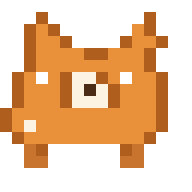
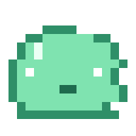
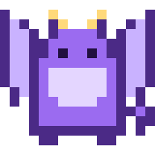
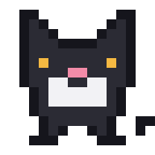
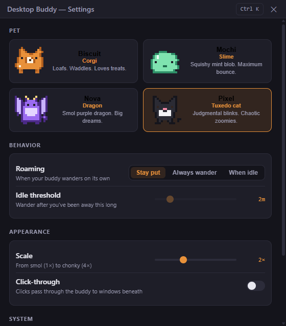

# 🐾 Desktop Buddy Kimi

A tiny desktop pet overlay app — pixel-art buddies that live on your screen.
Windows-first, cross-platform (Electron + TypeScript).

## The roster

| | Pet | Species | Vibe |
|---|-----|---------|------|
|  | **Biscuit** | Corgi | Loafs. Waddles. Loves treats. |
|  | **Mochi** | Slime | Squishy mint blob. Maximum bounce. |
|  | **Nova** | Dragon | Smol purple dragon. Big dreams. |
|  | **Pixel** | Tuxedo cat | Judgmental blinks. Chaotic zoomies. |

## Features

- 🪟 Frameless, transparent, always-on-top overlay window (click-through optional)
- 🔀 Hot-swap pets from the tray, settings, double-click, or command palette
- 🚶 Roam modes: stay put · always wander · wander only when you're idle (returns home when you're back)
- 🍬 Click your buddy or give it a treat — it animates
- 🔎 Command palette (`Ctrl+K`) fuzzy-searches every setting and action
- 📏 Resize from smol (1×) to chonky (4×)
- ⚙️ Settings window: dark, crisp, modern



## Quickstart

```bash
npm install
npm start          # run the app
npm run typecheck  # strict TS check
npm test           # unit tests
```

## Build a Windows exe

```bash
npm run dist       # -> out/Desktop Buddy <version>.exe (portable, no install needed)
```

Also produces `out/win-unpacked/` (plain folder build). The icon at
`assets/icon.png` is generated from code by `scripts/gen-icon.mjs` — no
hand-authored binaries.

## Repo conventions

See [AGENTS.md](AGENTS.md) — Hermes orchestrates, OpenCode implements, `gh` manages branches/PRs.

## Changelog

- **0.3.0** — Portable Windows packaging (electron-builder), generated app icon, Nova dragon rework
- **0.2.0** — Roaming behaviors, treats, right-click menu, settings UI, command palette
- **0.1.0** — Overlay foundation, sprite engine, 4 pets, tray, settings store
